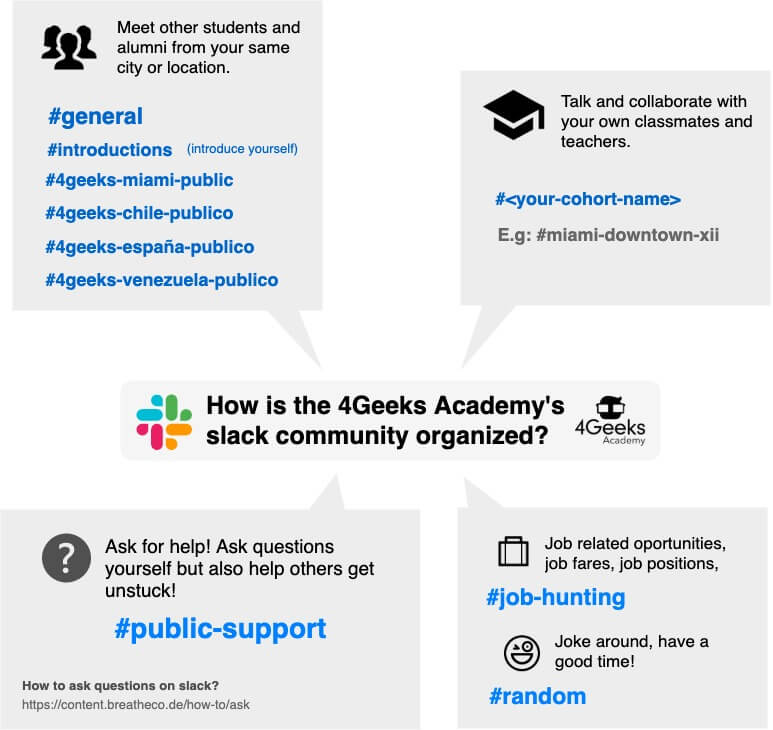

Primero que nada ¡¡¡¡POR FAAAAAVORRRR HAZ PREGUNTAS!!!!!! No nos cansaremos de repetirlo e incentivarte a que lo hagas, es la mejor manera de aprender. Es una gran fuente de información para entender las debilidades, nivel de comprensión y ritmo de aprendizaje de los estudiantes. Las preguntas también son la forma más poderosa para dejar de sentirse frustrado.

## Date un poco de tiempo (¡¡y de paciencia!!) para hacer la pregunta correcta

Cuando trabajas de manera remota, debes tener mucho cuidado con la manera en que expresas ideas, preguntas, etc.

Créeme cuando te digo que los siguientes pasos te permitirán obtener respuestas adecuadas en un par de minutos en vez de tener que repetir la pregunta una y otra vez.

Stack Overflow es una de las páginas más importantes en el mundo de la programación y ha publicado el siguiente manual sobre cómo hacer preguntas: [how to ask questions by stack overflow](https://stackoverflow.com/help/how-to-ask).

### 1. Prepara tu pregunta 

Si preguntas simplemente lo primero que se te pasa por la mente es probable que no obtengas una respuesta rápidamente, la persona que lea tu pregunta va a tener muchas dudas al respecto, probablemente tengas que aclarar infinidad de cosas.

Comparemos estas dos preguntas:

```md
1. ¿Cómo puedo agregar un item a un array?
2. Estoy intentando agregar un item a un array de la siguiente manera: blablabla... Este es mi código (screenshot o pantallazo) pero no está funcionando, ¿Ven algo malo?
```

¿Notas como la segunda pregunta es mucho más sencilla de responder? Probablemente tengas una respuesta en unos pocos minutos dado que será muy sencillo revisar tu código y darte feedback en unas pocas líneas. ¿Quién sabe? ¡Tal vez es solo un error de tipeo!

### 2. Toma fotos y un pantallazo en lugar de copiar y pegar tu código.

Usa pantallazos para mantener los colores y el formato. Pegar pedazos de código o de texto puede generar más confusión para quienes te están tratando de ayudar. Si pegas código en Slack, asegúrate de usar "adjuntar archivo".

Puedes utilizar algún plugin para Google Chrome como [Awesome Screenshot](https://www.awesomescreenshot.com/).

### 3. Sé específico

¿Cómo puedo COMENZAR A RESOLVER este ejercicio? o "Lo intenté de esta forma y no funcionó ¿Qué estoy haciendo mal? (incluye los mensajes de errores)", obtendrás mejor feedback que si preguntas ¿Cómo RESUELVO este ejercicio?. Mientras más dividas el proceso en pasos metódicos, más fácil te resultará comprender algo como un todo.


### 4. Investiga por tu cuenta antes de preguntar

Tómate unos 20 minutos para resolver el problema por ti mismo usando las respuestas de la terminal, realiza una búsqueda online y trata de definir una estrategia para probarla en tu código. Encontrar una respuesta específica te ayudará a resolver ese problema, pero si generas una estrategia efectiva para resolver problemas ¡podrás reutilizarla muchas veces más! 

### 5. Utiliza el canal de Slack en vez de correos electrónicos

Slack es la herramienta perfecta para esto, incluso puedes iniciar una videollamada. Evita usar métodos tradicionales menos efectivos como el teléfono o sms.

Entra al canal #public-support que es donde serás atendido más rápidamente.


