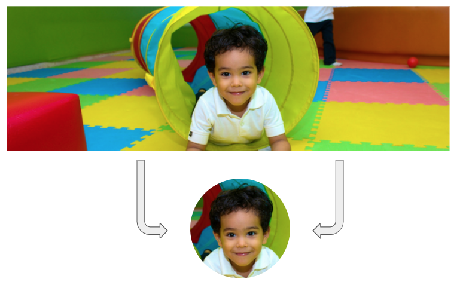
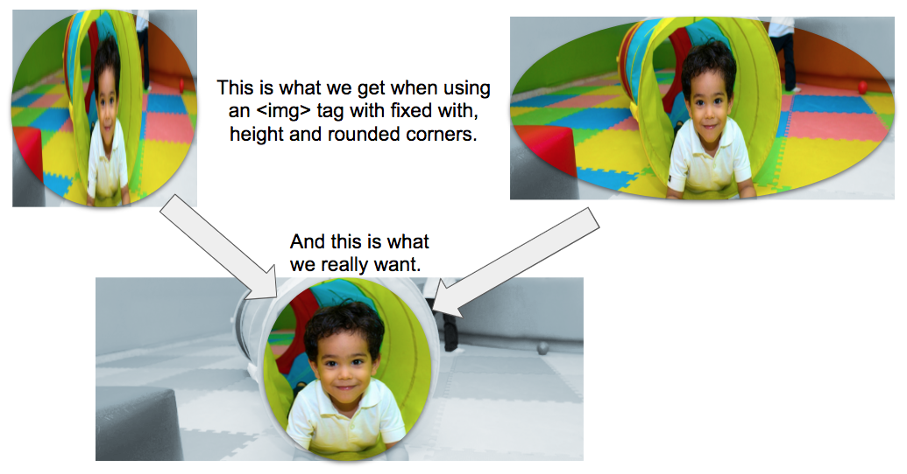
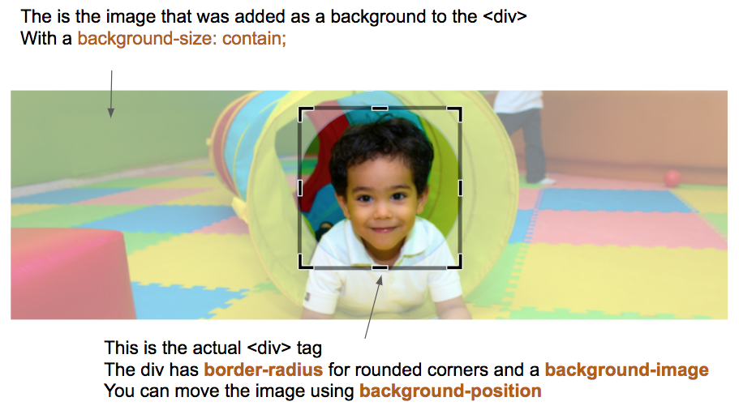

Muchos sitios web tienen fotos redondas de perfil ¡Es una técnica que realmente hace un sitio web más bonito!

La manera obvia de crear una foto de perfil redonda es haciendo una etiqueta  y aplicarle `border-radius:100%`. El problema es que esta solución solo funciona si la foto es cuadrada.... las fotos de perfil tienen diferente altura y ancho y no se verán redondas, se verán con óvalos:

En vez de hacer eso, lo correcto sería crear un div cuadrado ( es decir de igual altura y ancho), asignarle la imagen como fondo y luego aplicarle border-radius a ese div.

Si la imagen es más grande que el div (o tiene otras proporciones) podemos ajustar la background-position o background-size para escoger que parte de la foto queremos mostrar dentro del círculo

