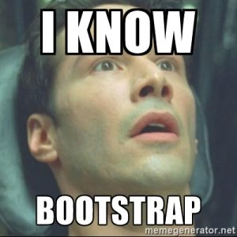
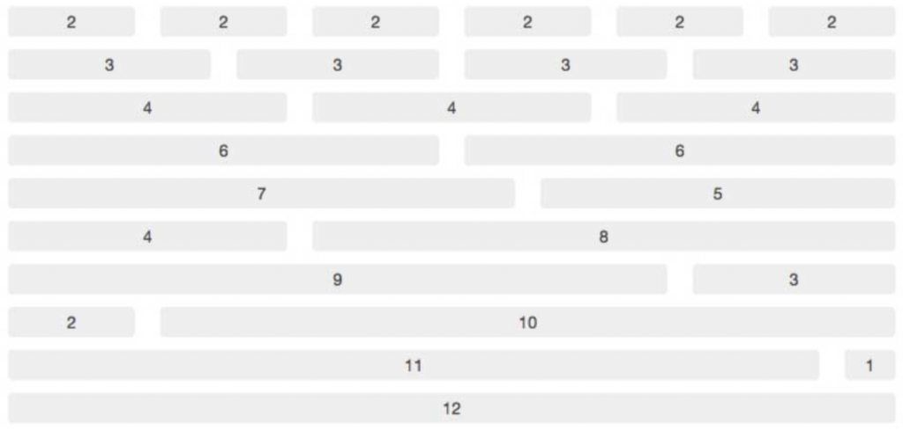
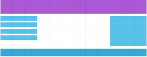
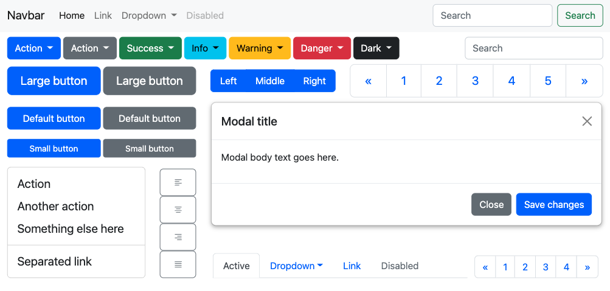
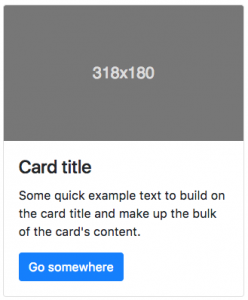
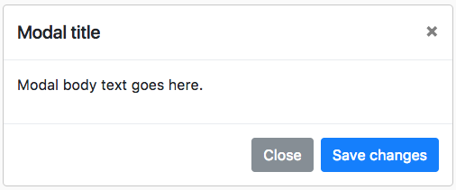

## Bootstrap fixed all CSS major problems

There is light at the end of the tunnel and it is NOT Chuck Norris holding a flashlight.  Finally, someone fixed CSS.  This is a library made by [Mark Otto](https://twitter.com/mdo?lang=en) and [Jacob Thornton](https://twitter.com/fat) – normal people – developers like you and me, and they did great!

These two guys working on Twitter were suffering the same problems we have been dealing with in HTML and CSS.  Fed up with the situation, they decided to build a **base CSS Sheet designed to be imported into any website**.  It makes every front-end development work 4x’s easier.



Besides, Bootstrap gives you a dozen of new elements that you would normally want to use but don’t actually exist in CSS+HTML: The Bootstrap components.

## Layouts: Solving the Box Model


One of the broken things in CSS is the way that layouts work – working with **float**, **display** and **position** sucks.  This is how Bootstrap solved it:

## Everything is now divided into Rows and Columns.

Bootstrap creators replicated the same concept that `<tables>` had, but instead of using tables, they used `<div>` (boxed containers).  They can’t create their own HTML tags because that will require a new HTML version and would make Bootstrap incompatible with current browsers.  Tags must stay the same – that’s why they decided to override the `<div>` default behaviors with classes.

```html
This is a row: <div class="row">
This is a column: <div class="col–sm–x">
```


Bootstrap has divided the width of the screen in `12 slots` – each of them with 8,33% of the total width of the row.  The size of 1 column, can be between 1 and 12 slots.

On the flip side, columns were made to live within the rows (just like what happens between `<td>` and `<tr>`).   You always need to open a row before opening a column.  All columns in a row must always add up to a maximum of 12 slots.



## Our first Layout example:

Just like we did in the Layout chapter of the course, let’s create one page with 2 big sections: one sidebar on the right and one main content on the left.

<iframe width="100%" height="300" src="//jsfiddle.net/BreatheCode/th7uLrow/6/embedded/html,css,result/" allowfullscreen="allowfullscreen" allowpaymentrequest frameborder="0"></iframe>

<div align="right"><small><a href="//jsfiddle.net/BreatheCode/th7uLrow/6/embedded/html,css,result/">Click here to open demo in a new window</a></small></div>

## Bootstrap is 100% Responsive

It’s very easy to decide how your website will render in different screen sizes; when you add each column into the rows you need to assign a class with the following format:

```html
<div class="col–md–x">
```

|**Col**   |**md**   |**x**
|:---------|:--------|:----|
|Means that this element should behave like a Bootstrap column.   |Means that it is specified for only for the devices with a "medium" sized screen.   |Specifies how many slots I want this column to take (remember you can take a max of 12 slots per row).   |

> :point_up:Bootstrap device sizes:   |Phones   |Big-phone/small-tablet   |Tablets   |Desktops   |Extra-large desktops   |
|:----------|:---------------|:-------------|:-----------|:------------|:---------|
| &nbsp;           |Nothing    |sm       |md       |lg      |xl        |

> :point_up: Note: if you don’t specify the screen size (ex. by using 'sm', 'md', or 'xl'), the website will be rendered for mobile phones by default.

## Defining Mobile, Tablet, and Desktop at the same time

We are going to set the layout (using the sm, md and lg column classes) for  two rows in all the devices at the same time:


```html
<!-- Stack the columns on mobile by making one full-width and the other half-width --> 
<div class="row">
  <div class="col-12 col-md-8">.col-12 .col-md-8</div>
  <div class="col-6 col-md-4">.col-6 .col-md-4</div>
</div>

<!-- Columns start at 50% wide on mobile and bump up to 33.3% wide on desktop --> 
<div class="row">
  <div class="col-6 col-md-4">.col-6 .col-md-4</div>
  <div class="col-6 col-md-4">.col-6 .col-md-4</div>
  <div class="col-6 col-md-4">.col-6 .col-md-4</div>
</div>

<!-- Columns are always 50% wide, on mobile and desktop --> 
<div class="row">
  <div class="col-6">.col-6</div>
  <div class="col-6">.col-6</div>
</div>
```

## Basic Bootstrap 4 Skeleton

We already know the basic HTML5 skeleton that any website needs to have.  Now you just have to add a few lines in your skeleton to make it "Bootstrap compatible":

```html
<!doctype html>
<html lang="en">
  <head>
    <!-- Required meta tags -->
    <meta charset="utf-8">
    <meta name="viewport" content="width=device-width, initial-scale=1, shrink-to-fit=no">

    <!-- Bootstrap CSS -->
    <link rel="stylesheet" href="https://stackpath.bootstrapcdn.com/bootstrap/4.1.3/css/bootstrap.min.css" integrity="sha384-MCw98/SFnGE8fJT3GXwEOngsV7Zt27NXFoaoApmYm81iuXoPkFOJwJ8ERdknLPMO" crossorigin="anonymous">

    <title>Hello, world!</title>
  </head>
  <body>
    <h1>Hello, world!</h1>

    <!-- Optional JavaScript -->
    <!-- jQuery first, then Popper.js, then Bootstrap JS -->
    <script src="https://code.jquery.com/jquery-3.3.1.slim.min.js" integrity="sha384-q8i/X+965DzO0rT7abK41JStQIAqVgRVzpbzo5smXKp4YfRvH+8abtTE1Pi6jizo" crossorigin="anonymous"></script>
    <script src="https://cdnjs.cloudflare.com/ajax/libs/popper.js/1.14.3/umd/popper.min.js" integrity="sha384-ZMP7rVo3mIykV+2+9J3UJ46jBk0WLaUAdn689aCwoqbBJiSnjAK/l8WvCWPIPm49" crossorigin="anonymous"></script>
    <script src="https://stackpath.bootstrapcdn.com/bootstrap/4.1.3/js/bootstrap.min.js" integrity="sha384-ChfqqxuZUCnJSK3+MXmPNIyE6ZbWh2IMqE241rYiqJxyMiZ6OW/JmZQ5stwEULTy" crossorigin="anonymous"></script>
  </body>
</html>
```

Remember, Bootstrap is just a stylesheet.  That’s why it is very simple to include in your website.  You use the `<link>` tag to include the styles, and, optionally, use the javascript `<script>` tag to include the Bootstrap Javascript files.

The Bootstrap Javascript functionality requires the jQuery and Popper Javascript libraries to be included first.  You don’t need to know the details about this yet.  Just include the JS libraries using the script tag and later you will understand.

> :link: Here you can find some [great Bootstrap files to get you started.](https://getbootstrap.com/docs/4.0/getting-started/introduction/)

## Bootstrap 4 Components

HTML is so basic that it only has a few tags – we know that already.  But when you browse the web today you see a different thing: websites today have menus, icons, load-bars, navbars, labels, etc.  Where are those tags?  None of those tags are defined in HTML!

Every developer has to fake these additional elements every time they create a new website.  They have to do everything from scratch, and it takes a lot of time.

When you import Bootstrap into your website, you will have a new set of components at your disposal.  This is just a small part of those elements:




### These are the most Important and Used Components in this Bootstrap tutorial:

#### The NavBar

This is so popular that it’s in the menu of 99% of all websites.  It normally has the logo of the company and a series of links – depending on each website’s business logic.

Here is an example of how a NavBar may look on a website:


> :link:[**Read more about the NavBar here**](https://getbootstrap.com/docs/4.0/components/navbar/)

```html
<nav class="navbar navbar-expand-lg bg-light">
  <div class="container">
    <a class="navbar-brand d-flex align-items-center" href="#">
      <svg xmlns="http://www.w3.org/2000/svg" width="17" height="17" fill="grey" class="mr-1"
        viewBox="0 0 16 16">
        <path
          d="M8 0C5.829 0 5.556.01 4.703.048 3.85.088 3.269.222 2.76.42a3.917 3.917 0 0 0-1.417.923A3.927 3.927 0 0 0 .42 2.76C.222 3.268.087 3.85.048 4.7.01 5.555 0 5.827 0 8.001c0 2.172.01 2.444.048 3.297.04.852.174 1.433.372 1.942.205.526.478.972.923 1.417.444.445.89.719 1.416.923.51.198 1.09.333 1.942.372C5.555 15.99 5.827 16 8 16s2.444-.01 3.298-.048c.851-.04 1.434-.174 1.943-.372a3.916 3.916 0 0 0 1.416-.923c.445-.445.718-.891.923-1.417.197-.509.332-1.09.372-1.942C15.99 10.445 16 10.173 16 8s-.01-2.445-.048-3.299c-.04-.851-.175-1.433-.372-1.941a3.926 3.926 0 0 0-.923-1.417A3.911 3.911 0 0 0 13.24.42c-.51-.198-1.092-.333-1.943-.372C10.443.01 10.172 0 7.998 0h.003zm-.717 1.442h.718c2.136 0 2.389.007 3.232.046.78.035 1.204.166 1.486.275.373.145.64.319.92.599.28.28.453.546.598.92.11.281.24.705.275 1.485.039.843.047 1.096.047 3.231s-.008 2.389-.047 3.232c-.035.78-.166 1.203-.275 1.485a2.47 2.47 0 0 1-.599.919c-.28.28-.546.453-.92.598-.28.11-.704.24-1.485.276-.843.038-1.096.047-3.232.047s-2.39-.009-3.233-.047c-.78-.036-1.203-.166-1.485-.276a2.478 2.478 0 0 1-.92-.598 2.48 2.48 0 0 1-.6-.92c-.109-.281-.24-.705-.275-1.485-.038-.843-.046-1.096-.046-3.233 0-2.136.008-2.388.046-3.231.036-.78.166-1.204.276-1.486.145-.373.319-.64.599-.92.28-.28.546-.453.92-.598.282-.11.705-.24 1.485-.276.738-.034 1.024-.044 2.515-.045v.002zm4.988 1.328a.96.96 0 1 0 0 1.92.96.96 0 0 0 0-1.92zm-4.27 1.122a4.109 4.109 0 1 0 0 8.217 4.109 4.109 0 0 0 0-8.217zm0 1.441a2.667 2.667 0 1 1 0 5.334 2.667 2.667 0 0 1 0-5.334z" />
      </svg>
      <span class="text-secondary">Instagram</span>
    </a>
    <button class="navbar-toggler" type="button" data-toggle="collapse" data-target="#navbarNavDropdown"
      aria-controls="navbarNavDropdown" aria-expanded="false" aria-label="Toggle navigation">
      <span class="navbar-toggler-icon"></span>
    </button>
    <div class="collapse navbar-collapse justify-content-end" id="navbarNavDropdown">
      <ul class="navbar-nav align-items-center">
        <li class="nav-item active">
          <a class="nav-link" href="#">
            <span class="btn btn-success">
              Create a new post
            </span>
          </a>
        </li>
        <li class="nav-item dropdown">
          <a class="nav-link dropdown-toggle text-secondary" href="#" id="navbarDropdownMenuLink" data-toggle="dropdown"
            aria-haspopup="true" aria-expanded="false">
            <svg xmlns="http://www.w3.org/2000/svg" width="16" height="16" fill="grey" class="bi bi-gear-fill"
              viewBox="0 0 16 16">
              <path
                d="M9.405 1.05c-.413-1.4-2.397-1.4-2.81 0l-.1.34a1.464 1.464 0 0 1-2.105.872l-.31-.17c-1.283-.698-2.686.705-1.987 1.987l.169.311c.446.82.023 1.841-.872 2.105l-.34.1c-1.4.413-1.4 2.397 0 2.81l.34.1a1.464 1.464 0 0 1 .872 2.105l-.17.31c-.698 1.283.705 2.686 1.987 1.987l.311-.169a1.464 1.464 0 0 1 2.105.872l.1.34c.413 1.4 2.397 1.4 2.81 0l.1-.34a1.464 1.464 0 0 1 2.105-.872l.31.17c1.283.698 2.686-.705 1.987-1.987l-.169-.311a1.464 1.464 0 0 1 .872-2.105l.34-.1c1.4-.413 1.4-2.397 0-2.81l-.34-.1a1.464 1.464 0 0 1-.872-2.105l.17-.31c.698-1.283-.705-2.686-1.987-1.987l-.311.169a1.464 1.464 0 0 1-2.105-.872l-.1-.34zM8 10.93a2.929 2.929 0 1 1 0-5.86 2.929 2.929 0 0 1 0 5.858z" />
            </svg>
          </a>
          <div class="dropdown-menu" aria-labelledby="navbarDropdownMenuLink">
            <a class="dropdown-item" href="#">Action</a>
            <a class="dropdown-item" href="#">Another action</a>
            <a class="dropdown-item" href="#">Something else here</a>
          </div>
        </li>
      </ul>
    </div>
  </div>
</nav>
```

#### The Card

This is probably the most used Bootstrap component; every website has a few cards because they are ideal for listing items in a beautiful way. Some examples of the Card being used can be:

+ The "team" section of a website, where you list the different employees.
+ The typical Pinterest wall.
+ The feed in any social media like Instagram, Facebook, twitter, etc.

Here is an example of how a "The Card" may look on a website:



> :link: [**Read more about the card here**](https://getbootstrap.com/docs/4.0/components/card/)

```html
<div class="card" style="width: 20rem;">
  
  <div class="card-body">
    <h4 class="card-title">Card title</h4>
    <p class="card-text">Some quick example text to insert on the card title and make up the bulk of the card's content.</p>
    <a href="#" class="btn btn-primary">Go somewhere</a>
  </div>
</div>
```


#### The Modal

Everyone hates a modal, it is super annoying, always asking you to subscribe to a newsletter! 🙂

Here is how a modal looks by default on Bootstrap.



> :link:[**Read more about modal here**](https://getbootstrap.com/docs/4.0/components/modal/)

```html
div class="modal" tabindex="-1" role="dialog">
  <div class="modal-dialog" role="document">
    <div class="modal-content">
      <div class="modal-header">
        <h5 class="modal-title">Modal title</h5>
        <button type="button" class="close" data-dismiss="modal" aria-label="Close">
          <span aria-hidden="true">&times;</span>
        </button>
      </div>
      <div class="modal-body">
        <p>Modal body text goes here.</p>
      </div>
      <div class="modal-footer">
        <button type="button" class="btn btn-primary">Save changes</button>
        <button type="button" class="btn btn-secondary" data-dismiss="modal">Close</button>
      </div>
    </div>
  </div>
</div>
```


> :point_up: Important! The Modal needs Javascript in order to work. Remember to include the three Javascript files that are needed in a typical Bootstrap Skeleton: jQuery, Popper and Bootstrap.js

## What you really need to know about Bootstrap

Bootstrap official documentation is amazing!  We don’t need to start copying and pasting all their posts.  Please visit the following and focus on reading these topics:

+ [The grid system.](https://getbootstrap.com/docs/4.1/layout/grid/)
+ [Styling Forms.](https://getbootstrap.com/docs/4.1/components/forms/)
+ [List of components available to use on your website.](https://getbootstrap.com/docs/4.1/components/alerts/)
+ [Utilities or Helper classes:](https://getbootstrap.com/docs/4.1/utilities/borders/) Very useful and constantly used classes to do stuff like centering the text, centering a column or container, adding a background, etc.

> :point_up: Bootstrap versions & download

Bootstrap has many versions, always check if you are using the latest version of Bootstrap on your project, here you can find all the available versions: [https://getbootstrap.com/docs/versions/](https://getbootstrap.com/docs/versions/).


We recommend using a CDN to import bootstrap in your HTML like this one: [https://www.bootstrapcdn.com/](https://www.bootstrapcdn.com/)

If you are migrating your project to a newer Bootstrap version remember to check its documentation.
