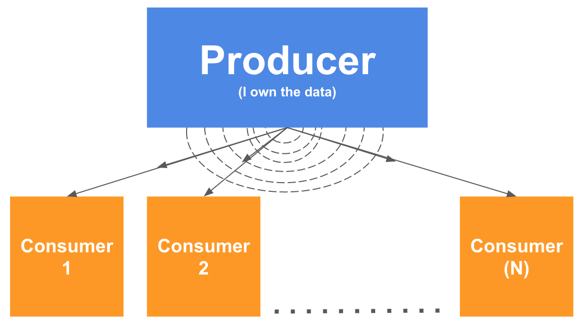

## No te asustes por "La API de contexto"

La API de contexto es una de las formas más fáciles en que el equipo de React.js ha propuesto controlar sus datos en aplicaciones pequeñas y medianas. Antes de Context, nuestra mejor esperanza era utilizar enfoques más complicados como Flux o Redux que realmente parecían una exageración en la mayoría de los casos.

### La vida antes de la API de contexto era más difícil

La gente dice que React.js hace que las cosas fáciles sean difíciles y las difíciles. Me encanta ese dicho, es tan cierto: :sweat:

1. ¿Por qué es tan difícil compartir algunos datos entre toda la aplicación?
2. ¿Por qué es tan difícil pasar datos entre componentes?
3. ¿Has intentado usar Redux?

La API de contexto está aquí para resolver algunos de esos enigmas:

1. Evita el "infierno de propiedades": si ya has trabajado con react, probablemente hayas sentido la frustración de pasar propiedades en toda tu aplicación, lo llamamos "infierno de propiedades".
2. Ten una aplicación global centralizada: en lugar de limitarte a los estados locales en las vistas, ahora puede compartir datos en un almacén central que está rápidamente disponible desde cualquier archivo, vista o componente javascript.
3. Propagación y representación de datos: si los datos cambian en cualquier momento, toda la aplicación volverá a generar y actualizará la interfaz de usuario con los nuevos valores.

## ¿Cómo funciona la API de contexto?

El concepto detrás es muy simple: **es un gran productor** y un **grupo de consumidores**. Cada vez que los datos del productor cambian, todos los consumidores son notificados. Puede pensarlo muy similar a cómo funcionan las redes de TV. Un canal de TV emite una señal de datos y todas las antenas de TV se notifican, reciben el nuevo contenido y renderizan la imagen en los televisores.

> Todo el mundo tiene acceso al contexto global ahora.



### La implementación más sencilla posible.

Después de un par de horas para hacer la implementación de la API de contexto más simple sin usar enlaces y esto es lo que obtuve en 5 pasos simples:

- **Paso 1 (Crear el contexto)**: Este paso casi no tiene lógica, simplemente llama a la función `createContext` y le pasa un objeto vacío. Ese objeto se compartirá con todos los consumidores durante el tiempo de vida de la aplicación, contendrá el **modelo de aplicación** y **las acciones**.
```js
// Paso 1: define un contexto que se compartirá dentro de toda la aplicación.
const GlobalContext = React.createContext({
  todos: ["Make the bed", "Take out the trash"]
});
```
- **Paso 2 (Modelo y acciones)**: Crea un `ThemeProvider` que deberá incluirse al principio de tu aplicación, debe serlo. Porque será responsable de proporcionar a los consumidores el contexto que acabas de crear en el paso anterior. El estado `ThemeProvider` es donde declararemos nuestros datos iniciales (**modelo**) y las funciones (**acciones**) que manipulan esos datos a lo largo de la vida de la aplicación.
```js
// Paso 2: Crea un ThemeProvider que debe ser el padre de cada consumidor.
class ThemeProvider extends React.Component {
	constructor() {
	    super();
	    this.state = {
		    // Este es el modelo de su aplicación, una lista de todo
		    todos: [],
		    // Agrega tantas acciones (funciones) como quieras
		    addTask: title => this.setState({ todos: this.state.todos.concat(title) })
	    };
	}
	render() {
		return (<GlobalContext.Provider value={this.state}>
	        {this.props.children}
		</GlobalContext.Provider>);
	}
}
```
- **Paso 3 (Vistas)**: No es el momento de crear la vista de la aplicación, usaremos el `ThemeProvider` dentro del método de renderizado de la aplicación y luego podremos agregar tantos componentes como queramos, y esos componentes tendrán acceso a GlobalContext si eso es lo que queremos, agregaremos el componente `<TodoList />` en avanzado (el que creamos en el último paso).
```js
// Paso 4: crea tu primera vista de aplicación con el componente ThemeProvider, 
// esta vista se agregará al documento usando la función ReactDOM.render ()
const MyView = () => (<ThemeProvider>
	<TodoList />
</ThemeProvider>);
```
- **Paso 4**: No permite crear un componente que tenga acceso al contexto global de la aplicación sin tener que usar accesorios. En este caso, el componente mostrará las tareas pendientes y también podrá agregar nuevas tareas a la lista.
```js
// Paso 5: Agregar la etiqueta del consumidor a cualquier componente 
// Quieres tener acceso al contexto global.
const TodoList = () => (<MyContext.Consumer>
    {context => (
		<div>
			{context.todos.map((task, i) => (<li>{task}</li>))}
			<button onClick={() => context.addTask("I am the task " + context.todos.length)}> + add </button>
		</div>
    )}
</MyContext.Consumer>);
```

## Prueba el código en vivo

<iframe src="https://codesandbox.io/embed/w75wq6v01k?hidenavigation=1" style="width:100%; height:500px; border:0; border-radius: 4px; overflow:hidden;" sandbox="allow-modals allow-forms allow-popups allow-scripts allow-same-origin"></iframe>