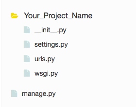
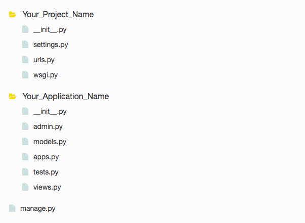

### Why Django?


At this point, as a developer, you have probably come to realize how important third-party libraries are to help yourself through coding.  99.99% of everything you are about to code has been built already.  There is a tool for everything, and, as developers, our job is to pick them wisely and integrate them in a coherent way to solve a particular problem.

Django is THE TOOL for web development.  It is not just a library – it is dozens of libraries grouped together.  It is a series of "best practices" and efficient ways of working.  These are some of the most amazing features:

+ It comes with a development server (minimum configuration) letting you start coding right away.
+ It has Command Line Interface (manage.py) that speeds up the development process.
+ Documentation and community: The django community is so big that you will not have any trouble finding answers, tutorials, etc.

## The Django Architecture


Just like any other framework, Django proposes a specific architecture to build your software and we have to learn, adopt and master all of it if we want to become Senior Full-Stack Developers (using Django):

<before-after 
    before="../../assets/images/61212ca7-cde0-43c1-8267-a1101a95da2c.png" after="../../assets/images/80444105-0d6a-4a93-beb1-090b84b03376.png" />

The first important concept to learn is Website vs App.  A great example can be BreatheCo.de

BreatheCode is a big django website with several applications inside:

+ admin.breatheco.de: This is the administration portal where all students, cohorts and locations are managed.
+ breatheco.de: This is the student access to the courses.
+ assets.breatheco.de: This is the useful compilation of tools for both the teacher and students.
  
All of those apps can be a part of a big website called "BreatheCode Platform".

## Creating a New Project


to start a new project all you have to do is:

```bash
$ django-admin startproject [project_name]
$ cd [project_name]
```

That will create a new folder in your current directory with the name of the project and a series of files.

#### Don’t be afraid of the generated files!

Remember everything is just text!  You can and should play with the generated files to understand them properly.  Who cares if you break it?  The worst that could happen is that you have to run the createproject command again 🙂

After running the command, a project folder will be created with at least 4 files inside:



+ `__init__:` an empty file that any folder needs to have inside to be considered a python package.
+ `settings:` contains all the configuration variables for your project – we will address this file further later.
+ `urls:` contains all the URL routs of your website, the /admin route is added by default to all Django projects.
+ `wsgi:` contains logic for theDjango server.

The `manage.py` file outside is a CLI tool to be able to control and use Django from the command line – you will be using this on a daily basis.


## Creating the First Application


Now that we have a big project (website) it is time to start adding applications to it.  To create your first Django application, type the following command:

```python
$ python manage.py startapp [app1_name]
```


> :point_up:  <span style="color:white"> To run this command, you have to be standing in the same folder as the manage.py file.  You can use the CD command to move to that same folder.</span>

#### Again, don’t be afraid of the generated files!

You will see a new folder with your application name and a bunch of new files inside.  Let’s review them:



+ `__init__:`  Tells Python that this folder is a package.
+ `admin.py:`  Here we can add models into the admin interface to be able to CRUD those models.
+ `models.py: ` Here we will need to define our database model (all the object structures we want to store into a database).
+ `apps.py:`  Don’t touch this – it describes what applications we have.
+ `tests.py:`  Here you can write your application [unit tests.](https://en.wikipedia.org/wiki/Unit_testing)
+ `views.py: ` Here you have to describe how your HTML or JSON files are going to be built.

Lets discuss all of these in more detail below.

To summarize, and continuing with our "BreatheCode Project" example, this is how your project file structure may look after you have several apps inside one big project.


### Manage.py (Django CLI)

The Manage.py file is an amazing command line tool that will help you a lot.  It is not only useful to create new applications inside your project, but all for all of these other tasks (and more):

|&nbsp;     |&nbsp;      |
|:----------|:-----------|
|Create admin users for your applications      |`$ python manage.py createsuperuser`         |
|Running the python development server         |`$ python manage.py runserver $IP:$PORT`     |
|Making migrations                             |`$ python manage.py makemigrations [your_appliation_name]`        |
|Running migrations                            |`$ python manage.py migrate`           |


## Django Architecture to build RESTful APIs


We are going to be building a REST Based API, but don’t be afraid of the name – the REST standard basically was built as an extremely simple API.

> :point_up: :tv: You can read more about REST APIs on this BreatheCode Lesson.<br> <br>Here is a cool 8 min video explaining REST: https://www.youtube.com/watch?v=7YcW25PHnAA


### Here is how Django handles any API HTTP Request:

+ The first piece of code that deals with the Request will be the URL Dispatcher (urls.py).  Its main objective is to understand what corresponding APIView should be instantiated based on the URL that was called, and then finally call the GET, POST, PUT or DELETE method of that APIView depending on the Request Type.

+ As a second step, the APIView receives the URL parameters (if any) through the method parameters and then executes any logic coded to process the request or database model interactions.  For example: Getting some information from the DB; saving or deleting some other information; sending emails, etc.

+ The next step, should be to decide what JSON should be returned inside the body of the Response.  For that we have the serializer.


+ Finally, the APIView should return a Response object that contains the JSON Object prepared by the serializer.

<BeforeAfter width="900px"
    before="../../assets/images/c7e96be7-a7b6-4b6d-83a2-535b22fdc3b0.png" after="../../assets/images/88f6b44f-01dc-4a13-ba1f-fbab5280d510.png" />

### urls.py: The URL Dispatcher

```python
from django.urls import include, path
from . import views

urlpatterns = [
    path('games/', views.GamesView.as_view(), name='games'),
    path('game/', views.GameView.as_view(), name='game'),
    ...
]
```

The urls.py file contains an array ***PATHs***.  Each path starts with a URL pattern followed by the ***VIEW*** that is supposed to manage that path and 2 optional parameters: ***NAME***:  To identify the path; and ***KWARGS*** : a list of values that can be passed to the ***VIEW.***

### view.py: The Rendering Logic

```python
class GamesView(APIView):
    def get(self, request):
        games = Game.objects.all()
        serializer = GameSerializer(games, many=True)
        return Response(serializer.data)
    def post(self, request, game_id):
         # any logic for the post request 
        pass
```
"Views" are called "views" because their main responsibility is to generate the response that is going to be sent to whoever requested it.  For example: Returning a JSON or returning an HTML document.

But views have another responsibility: Views need to take care of any needed logic before sending the response back.  For example, if the incoming request was a POST request to update a user, then the view needs to first interact with the Database and update the user FIRST; then it can go ahead and return the updated user as a JSON object.

The example on the left is a view that will take care of two possible requests: The **GET** and the **POST** for the ***/game*** URL.  For the GET, the GamesView will get all the Game objects from the database and return a JSON with the list of them; for the POST the GamesView does not have any logic yet, but it should look for the particular Game with that given game_id and update it.

### models.py: Database Model

```python
from django.db import models

# Create your models here. 
class Game(models.Model):
    player1 = models.CharField(max_length=20)
    player2 = models.CharField(max_length=20)
    winner = models.CharField(max_length=20)
```

Models.py is that place where you define all the objects that will be saved into the database and all the logic needed to interact with them. You also need to specify the data-type for each of the properties each object has.

The example we have been using only needs the Game Class as Model, and the Game class has only 3 properties.

### tests.py: Application Tests

```python
from django.urls import include, path
from . import views

urlpatterns = [
    path('games/', views.GamesView.as_view(), name='games'),
    path('game/', views.GameView.as_view(), name='game'),
    ...
]
```

The urls.py file contains an array ***PATHs***.  Each path starts with a ***URL*** pattern, followed by the ***VIEW*** that is supposed to manage that path and 2 optional parameters: ***NAME:*** To identify the path; and ***KWARGS*** : a list of values that can be passed to the ***VIEW***.

> :tv: <span style="color:white">Here is a 5 video series that explains django APIs in an amazing way:</span> https://www.youtube.com/watch?v=Yw7gETuRKjw&index=37&list=PL6gx4Cwl9DGBlmzzFcLgDhKTTfNLfX1IK


> :link: This website contains amazing Django resources: http://awesome-django.com
