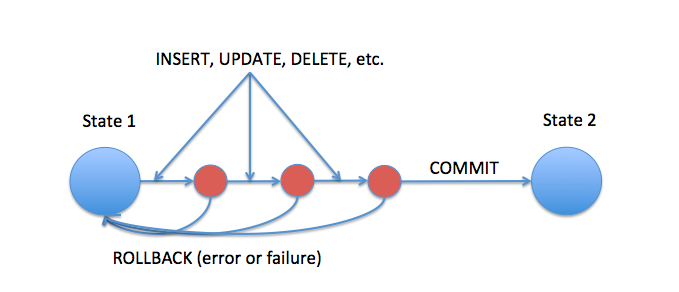
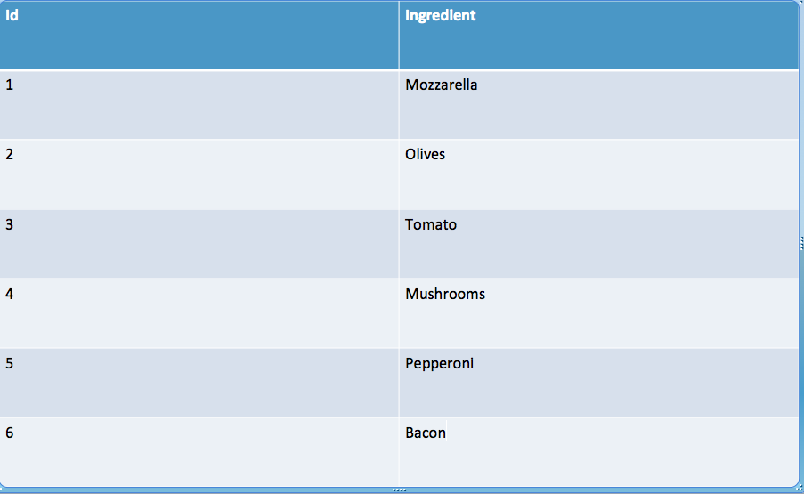
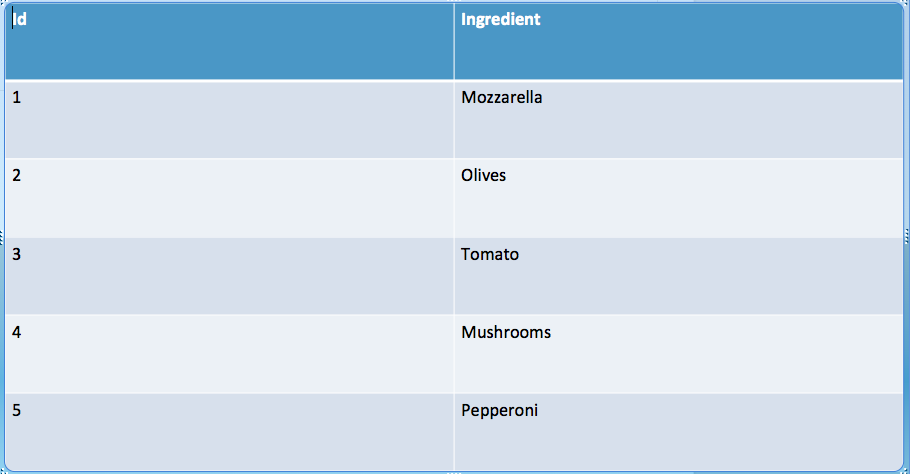

## What is SQL Alchemy

SQL Alchemy is an [Object-Relational Mapper / Mapping-tool](https://en.wikipedia.org/wiki/Object-relational_mapping), or ORM: a library that developers use to create databases and manipulate their data without the need of knowing/using SQL.

There are other alternatives to it like SQLAlchemy like Peewee, and other languages have their own ORM's like PHP Eloquent or Java Hibernate.

## Why Use ORM?

ORM's have gained popularity because dealing with SQL language directly requires a lot of effort in many cases. The goal of any ORM is to simplify the maintenance of your data. This is done by creating ***objects*** to deal with database interactions.

With ORM you won't have to type SQL again (95% of the time) and you will be able to work with objects.

### Example:

To insert an user with SQL you have to type:

```sql
INSERT INTO user (name, last_name) VALUES ('Bob', 'Ross');
```

With an ORM your code keeps being familiar like this:

```py
user = User()
user.name = 'Bob'
user.last_name = 'Ross'

db.session.commit()
```
You can just say: `db.session.commit()` and all the things you have done in your code will be translated into SQL language code.

## Let's review the most typical database operation

## Creating our database


The first step will be defining our model

```py
class Person(Base):
    __tablename__ = 'person'
    # Here we define columns for the table person
    # Notice that each column is also a normal Python instance attribute.
    id = Column(Integer, primary_key=True)
    name = Column(String(250), nullable=False)


    def serialize(self):
        return {
            "id": self.id,
            "name": self.name
        }
  ```

### INSERT: Inserting a Database Record

All you have to do is create a new Person object, add it into the database session and commit!
Just replace `<username_value>` and `<email_value>` with the real values you want added below.

```py
person = Person(username=<username_value>, email=<email_value>)
db.session.add(person)
db.session.commit()
```

### SELECT: Fetching / Retrieving Records

There are 3 ways to retrieve data from a database:
    1. Fetch all record from a particular Table/Model using `MyModel.query.all()`
    2. Fetch one single record based on its primary key using `MyModel.query.get(id)`
    3. Fetch a group of records based on a query `Person.query.filter_by(arg1=value, arg2=value, ...)`

```py
# here is how to fetch all people
all_people = Person.query.all()
all_people = list(map(lambda x: x.serialize(), all_people))

# here is how to fetch a group of people with name = alex
all_people = Person.query.filter_by(name='alex')
all_people = list(map(lambda x: x.serialize(), all_people))

# here is how to fetch the person with id=3 (only works with primary keys)
person = Person.query.get(3)
```

### DELETE: Removing a Database Record.

All you have to do is create a new Person object, add it into the database session and commit!

```py
person = Person.query.get(3)
db.session.delete(person)
db.session.commit()
```

### UDPATE: Updating a Record

To update you need first to retrieve/select the record from the database, then you can update whatever property you like and commit again.

```py
person = Person.query.get(3)
person.name = "Bob"
db.session.commit()
```
## Transactions

A transaction is a sequence of operations (like INSERT, UPDATE, SELECT) made on your database. In order for a transaction to be completed a number of operations within a group must be successful. If one operation fails, the whole transaction fails.


Transactions have the following 4 standard properties(known as ACID properties):


A transaction ends with COMMIT or ROLLBACK. 

### COMMIT: session.commit() 

COMMIT command is used to permanently save any transaction into the database.

When you use INSERT, UPDATE or DELETE, the changes made by these commands are not permanent, the changes made by these commands can be undone or "rolled back". 

If you use the COMMIT command though the changes to your database are permanent.

### ROLLBACK

It restores the database to last your last COMMIT. You can also use it with SAVEPOINT command to jump to a savepoint in a ongoing transaction.

Also, if you use UPDATE to make changes to your database, you can undo them by using the ROLLBACK command but only if you haven't commited those changes like this:


```jsx
session.rollback();
```
### SAVEPOINT 

This command is used to temporarily to save a transaction so that you can go back to a certain point by using the ROLLBACK command whenever needed, you can use like this:
```jsx
session.begin_nested();
```
This command may be called many times, and it will issue a new SAVEPONT with an ID.



Now let's say we go out to have some pizza. Our pizza comes with three ingredients basic ingredients:
mozzarella, tomato, olives. Our table called 'PIZZA' would look like this: 


But we have a list of extra ingredients we can add to it: first we choose meat but then we change our mind and we want to add mushrooms instead. We would also like to add some pepperoni and bacon. Let see how could we do that:

```jsx
INSERT INTO class PIZZA(4, 'meat');

session.commit(); 

UPDATE class SET ingredient = 'mushrooms' WHERE id '4'

session.begin_nested(A);

INSERT INTO class PIZZA (5, 'pepperoni')

session.begin_nested(B)

INSERT INTO class PIZZA (6, 'bacon')
```

Now our 'PIZZA' has the following ingredients:



Now we have decided we no longer want bacon, so we use ROLLBACK:

```jsx
session.rollback(B);
```
and our pizza looks like this:



....I'm a bit hungry after reading this lesson!! aren't you??


  
