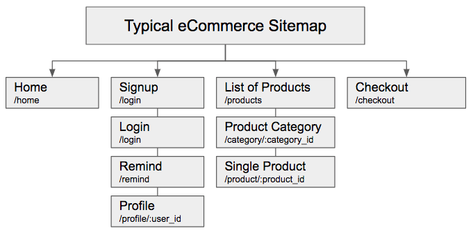
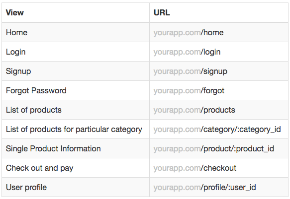

## ¿Qué es React Router?


React Router, una librería JS disponible a través de NPM que ayuda principalmente con 2 problemas:

+ Visualización condicional para los componentes React basados en la URL del sitio web actual.
+ Navegación de aplicaciones web sin necesidad de actualizar.

```bash
$ npm install --save react-router
```

## ¿Por qué necesito esto?


Deja de leer si no estás creando aplicaciones completas usando React, no necesitas React-Router para aplicaciones de una sola página o componentes pequeños.

Para el resto de nosotros que creamos aplicaciones web reales, necesitamos conectar varias vistas (componentes React) en una sola aplicación grande. Ese proceso se llama  "routing" (enrutamiento).

Por ejemplo, necesitamos las siguientes URL de aplicación para que coincidan con los siguientes componentes:


## Definiendo tus Rutas de Aplicación


¿Qué páginas/vistas quieres que tenga tu aplicación? Siempre puedes empezar con lo básico:

+ Home: Lo que sus usuarios públicos ven cuando llegan a tudominio.com
+ Login/Signup/Forgot: Un formulario de inicio de sesión y un formulario de registro y el formulario de recordatorio de contraseña.
+ Private: Lo que sus usuarios privados ven justo después de iniciar sesión.

El resto de las páginas dependen de tu aplicación y de cómo quieres que los usuarios naveguen por tu sitio.



## Mapeando tus Vistas a URLs

Este es el mapa del sitio para cualquier sitio web de comercio electrónico típico:



## Codificando tus Rutas de Aplicación

Una vez que hayas terminado de asignar las vistas de la aplicación con las URL, puedes comenzar a programar todo, ¡y aquí es cuando entra en juego React-Router!

La mejor práctica es siempre crear un componente llamado `<Layout />` que se encargue de encaminar al usuario a las vistas específicas que debería ver, dependiendo de cada URL en particular.

Este es un ejemplo del mismo mapa del sitio de comercio electrónico pero ahora utilizando React Router v4:

```jsx
//Este componente Layout se encargará de enrutar las URL con todas las vistas de mi aplicación

export class Layout extends Flux.View {
    render() {
        return (
            <div>
                <BrowserRouter>
                    <div>
                        <Switch>
                            <Route exact path="/" component={Home} />
                            <Route exact path="/home" component={Home} />
                            <Route exact path="/log-in" component={Login} />
                            <Route exact path="/sign-up" component={Signup} />
                            <Route exact path="/remind" component={Remind} />
                            <Route exact path="/products" component={Products} />
                            <Route exact path="/category/:category_id" component={Category} />
                            <Route exact path="/product/:product_id" component={SingleProduct} />
                            <Route exact path="/checkout" component={Checkout} />
                            <Route exact path="/profile/:user_id" component={Profile} />
                            <Route render={() => <h1>Not found!</h1>} />
                        </Switch>
                    </div>
                </BrowserRouter>
            </div>
        );
    }
}
```

Hay 3 componentes que entender aquí:

+ `<BrowserRouter>` : Cada vez que abres una nueva etiqueta de BrowserRouter, básicamente le estás diciendo a React que todo lo que está en el medio debe ser condicionalmente renderizado en base a <Routes> particulares (URL).
+ `<Switch>` : Funciona de manera similar a la instrucción de cambio en Javascript pero para Rutas... Le dice a React que se mostrará la única `<Route>` que coincide con la URL que se mostrará.
+ `<Route>` : Es la forma en que React-Router tiene que mapear rutas con componentes, por ejemplo:

```jsx
<Route exact path="/sign-up" component={Signup} />
```

Esta ruta le dice a React que cuando la URL coincida con "sign-up", debería mostrarse el componente Signup.

## Las anclas `<a>` ahora son un problema

Los anclajes llevan a los usuarios a otros sitios web o URL - y eso es sorprendente para un HTML + JS basico - pero ahora NO queremos que nuestros usuarios sean llevados a otros sitios web o URL. Queremos que permanezcan en la misma pestaña pero cargando la página siguiente sin tener que actualizar. Tenemos dos formas posibles de hacer eso:

### 1. Usando una etiqueta `<Link>`:

React Router creó un componente que podemos usar en lugar de `<a>`

```jsx
<Link to="/login">Take me to login</Link>
```

### 2. Usando this.props.history.push(‘new/url/here’);

React Router siempre pasa una prop a cada vista un elemento llamada "history" que contiene muchas información útiles para usar cuando se enruta a los usuarios. Una de las muchas utilidades es la función "push" que básicamente redirige al usuario a la ruta dada.

```jsx
<button onClick={() => this.props.history.push("/login")}>Take me to login</button>
```

## Ejemplo en Vivo:

Aquí hay un ejemplo en vivo que utiliza todo lo que hemos aprendido durante esta lectura, haz clic y juega para entenderlo, aprenderlo y repetirlo:

<iframe src="https://codesandbox.io/embed/0okp853rxn?autoresize=1&amp;module=%2Fsrc%2FLayout.jsx&amp;moduleview=1" style="width:100%; height:500px; border:0; border-radius: 4px; overflow:hidden;" sandbox="allow-modals allow-forms allow-popups allow-scripts allow-same-origin"></iframe>

<div align="right"><small><a href="https://codesandbox.io/embed/0okp853rxn?autoresize=1&amp;module=%2Fsrc%2FLayout.jsx&amp;moduleview=1">Haz clic aquí para abrir el demo en una nueva ventana</a></small></div>


