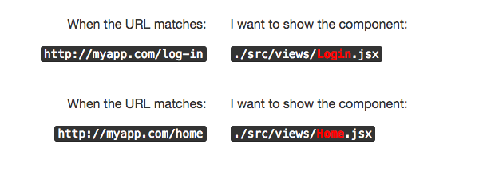

## What is React Router?

React Router is a JS library available through NPM that helps mainly with 2 problems:

+ Conditional display for React components based on the current website URL.
+ Web application navigation without having to refresh.

This is how you would install react router in your project:

```bash
$ npm install --save react-router
```

## Why do I need this?

Stop reading if you are not building entire applications using React, you don’t need React-Router for single page applications or small components.

For the rest of us building real web applications, we need to connect several views (React components) into one big application. That process is called "routing."

For example, we need the following application URLs to match the following components:



## Defining your Application Routes

What pages/views do you want your app to have? You can always start with the basic ones:

+ Home: What your public users view when they land in yourdomain.com
+ Login/Signup/Forgot: A login form and signup form and the password reminder form.
+ Private: What your private users view right after they log in.

The rest of the pages depend on your application and on how you want your users to navigate through your site.


## Mapping your Views to URLs

This is the sitemap for any typical e-commerce website:


## Coding your Application Routes

Once you have finished mapping your application views with URLs, you can start coding everything and that is when React-Router comes in!

The best practice is always creating one component called ` <Layout /> ` which will take care of routing the users to the specific views they should see, depending on each of the particular URLs.

This is an example of the same e-commerce sitemap but now using React Router v6:

```jsx 
//this component Layout will take care of routing the URLs with all my application views 

export const Layout = () => {
    return (
        <div>
            <BrowserRouter>
                <Routes>
                    <Route element={<Home />} path="/" />
                    <Route element={<Demo />} path="/demo" />
                    <Route element={<Single />} path="/single/:theid" />
                    <Route element={<h1>Not found!</h1>} />
                </Routes>
            </BrowserRouter>
        </div>
    );
}
```

There are 3 components to understand here:

+ `<BrowserRouter>`: every time you open a new BrowserRouter tag, you are basically telling React that everything that is inside must be conditionally rendered, based on particular <Routes> (URLs).
+ `<Routes>`: works similar to the switch statement in Javascript but for Routes... It tells React that the only first `<Route>` that matches the URL will be displayed.
+ `<Route>`: it’s the way of React-Router to map routes with components, for example:

```jsx
<Route path="/sign-up" element={<Signup />} />
```

This route is telling React that when the URL matches "sign-up", the component Signup should be displayed.

## Anchors ` <a> ` are now a Problem

Anchors take users to other websites or URLs, and that is amazing for simple plain HTML+JS, but now, we DON’T want our users to be taken to other websites or URLs. We want them to remain in the same tab but be able to load the next page without having to refresh. We have two possible approaches of doing that:

### 1. Using a ` <Link> ` tag:

React Router created a component that we can use instead of ` <a> `:

```jsx
<Link to="/login">Take me to login</Link>
```

### 2. Using history.push(‘new/url/here’):

React Router always passes to each view a prop called "history" which contains a lot of useful information to use when routing users. One of its many useful utilities is the "push" function that basically redirects the user to a given path.

You can access the history object by using `useNavigate` hook like this:

```js
import { useNavigate } from "react-router-dom";

// inside the component you declare the navigate this way:
const navigate = useNavigate();
```

Then, anywhere in any of your components, you can programatically redirect users to another URL like this:

```jsx
<button onClick={() => navigate("/login")}>Take me to login</button>
```

## Live Example:

Here is a live example using everything that we’ve learned in this reading. Please click and play to understand it, learn it and replicate it:

<iframe src="https://codesandbox.io/embed/infallible-glitter-soi3js?autoresize=1&amp;module=%2Fsrc%2FLayout.jsx&amp;moduleview=1" style="width:100%; height:500px; border:0; border-radius: 4px; overflow:hidden;" sandbox="allow-modals allow-forms allow-popups allow-scripts allow-same-origin"></iframe>

<div align="right"><small><a href="https://codesandbox.io/embed/infallible-glitter-soi3js?autoresize=1&amp;module=%2Fsrc%2FLayout.jsx&amp;moduleview=1">Click here to open demo in a new window</a></small></div>
