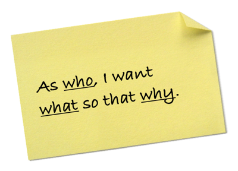
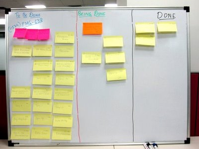

## What is a "User Story"?
***

<iframe width="1185" height="667" src="https://www.youtube.com/embed/LGeDZmrWwsw" frameborder="0" allow="accelerometer; autoplay; encrypted-media; gyroscope; picture-in-picture" allowfullscreen></iframe>

<div align="right"><small><a href="https://www.youtube.com/embed/LGeDZmrWwsw">Click here to open video in a new window</a></small></div>

The hardest thing to do in software is not coding – it is designing the system! And we are NOT talking about graphic design…we are talking about architecture, data modeling, customer requirements, etc.  Some of those things are harder than others, but doing a list of requirements is probably one of the trickiest arts.

**What is a Feature?** It is a functionality that the application has!  For example: sign-up, sign-in, vote, buy, etc.

Describing a feature seems easy, but it can be challenging:  Where should you start?  How detailed should it be?  How technical can you be?  But, don’t worry…"user stories" have come to the rescue!

User stories have become very popular as a feature-based-documentation-standard because they cut all the fat from the process.  The are straightforward, easy to understand by everyone involved (not just the developers), and easy to test.

### What is so Special about them?
***

A user story is like having a conversation with your future user.  They must be written in standard non-technical English for 12 year old kids with a low attention span:

+ Around 100 characters max each:  The less the better!
+ With just ONE functionality for each 0ne – if you see it getting bigger, just split the story into 2 different stories.

13#### Here are some Examples:


### How should you Write the User Stories?
***

It is so simple that it becomes tricky…the most important thing is to: (1) Maintain simplistic language, (2) Keep it short, and, (3) Specify:

+ **Role:**  Who is able to use the feature?
+ **Feature:**  What is the feature about.
+ **Reason:**  What is the reason to do so.

<p align="center"; style= "font-size:30px" > As a <font color="blue">[role]</font>, I can <font color="#ff00ff">[feature]</font> so that <font color="blue">[reason]</font></p>

Let’s look at another example:
```jsx
As an "account owner", I can "check my balance online" so that "I can keep a daily balance 24 hours a day."
```

Pretty easy right?  However, in some instances we find that the "so that" suffix reads redundantly, so go ahead and make that optional, if you wish.

```jsx
As an "account owner", I can "check my balance online".
```

Feel free to use slight deviations of this template using synonyms:

+ **As a [role], I want [feature] because [reason]**
+ **As a [role], I can [feature]**
+ **As a [role], I can [feature] so that [reason]**

### Tools for Writing User Stories

There are millions of tools; we have Googled some: [click here to access. ](http://lmgtfy.com/?q=free+tools+to+write+user+stories) Some are free, and some cost money, but throughout the years we have decided to do them ourselves using index cards.  If you insist on using something digital, you should use [this document](https://docs.google.com/spreadsheets/d/1Lj6NBXGLgAY-dyCHkVQIJdG6IbqrGRw6p6k3q-jb7tE/edit?usp=sharing) template that we have prepared for you.

### Use Index Cards and a Sharpie



The theory is simple – if you use any larger than a 3" x 5" index card, you will write too much.  Likewise, if you use anything smaller than a marker (such as a ball point pen) – you will write too much.

User stories are suppose to be short and sweet.  They are suppose to aid in further communication and not tell the entire long-winded version of the story.  Sticking to these physical constraints will help.

At the end you will have a huge "to-do list," with the stories moving from "To-do" to "Doing" and, finally, to "Done."  Each story will be assigned to one developer at the beginning of each planning meeting.



### When is a Story really "Done"?

If stories  are short and sweet – how are we suppose to know all the different acceptance criteria?  On the back of each story we will have to enter some "acceptance criteria" that we can check at the end when the developer thinks the feature is done.

To write great acceptance criteria, we need to think not only about the usual expected behavior in the application, but also about any cases where the app should fail (for example: When you specify a wrong password, when your credit card is rejected, etc.).

##### For Example:

**User Story:**
"As a music lover I want to be able to pay for my album with my VISA card"

**Examples of Acceptance Criteria (specific for this story):**

+ I can purchase an album with my VISA card
+ I cannot pay with a VISA card that’s expired
+ I cannot pay with a VISA card with a wrong number

## Don’t get Obsessed!
***

Please, this is a course about full-stack web development.  You don’t have to write the best stories ever made.  Perfect does not ship!  Take some time to think about your stories, but don’t get stuck during the process.

You will be using user stories a lot, but, as a developer, it is not your responsibility to write them.  There are people certified for that (Requirement Analysts).  Your job is to read them and follow them.


