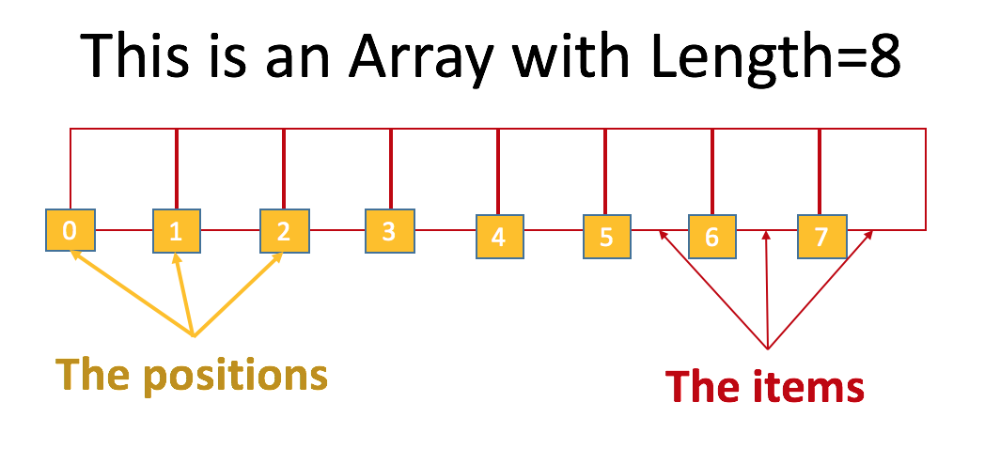

## Introduction to Python lists

Mastering the use of lists and loops is one of the 5 fundamental skills of building algorithms:

1. Variables.
2. Conditionals.
3. `Lists`.
4. `Loops`.
5. Functions.


## What is a List?

A list is, normally, any collection of values.  The rules of how to add or remove elements from that list can change from one programming language to another.  But – generally – they are the only ways for developers to create elements.
Lists are not the only way we have to list store multiple values at once but it is the most used tool for that purpose. For example: list of students, list of artists, list of transactions…anything!

This primitive data-type does a lot more stuff than the others.

Every list has the same basic concepts:

**The items:** are the actual values inside in each position of the list.

**The length:** is the size of the list (how many items the list has).

**Index:** is the position of the element.




[[info]]
| :point_up:List positions start a **zero (0)**; the first element is the element in the position **zero (0)**

## How to Declare a List?
***

These are different examples of list declarations:

```python
myList = [] # lista vacia
myList = ["Apple", "Orange", "Donkey"] # The only way to declare a list
myTuple = ("Apple", "Orange", "Donkey") # this is not a list, its a more limited version called "Tuple"
mySet = {"Apple", "Orange", "Donkey"} # this is not a list, it's a "set" (more limited version of list)
```

## Access Items in the List
***

To access a specific element in a list, you need an `index`.  We call `index` the integer value that represents the position of the element you want to access/get/retrieve.

The index always must start at zero (0).  That means that an List of 2 items can have index=0 or index=1.  Trying to get the 2nd position will return "undefined" because it will mean that we are trying to access the third element (which does not exist).  For example, to get any items in the list you can do the following:

```python

print(myList[0])  # print first element on the console

aux = myList[3]
print(aux); # print the 4th element on the console
print(myList[len(myList) - 1]);  # Print the last element on the console
```


## Update Items in the List
***

If you want, you can reset or update any item inside of an list using the index like this:

```python
    myList[5] = 'Whatever value'
    # Assign a value to 6th element on the list 
```

## Adding Elements to Python Lists (append and insert)
***

### Using `append` in Python Lists

The first way is to add the element to the end of the list, you should use this method every time you can because it's a lot faster than `insert`.

```python
    myList = ['Pedro','Juan','Maria']
    myList.append('Chris') # add Chris to the end of the list
    print(myList); # Output: ['Pedro','Juan','Maria','Chris'];
```

### Using `insert` in Python Lists

Using insert its easier for the developer because it will let you pick the positions in which you want to inster the element, but it is a slower method (less performance):

```python
    myList = ['Pedro','Juan','Maria']
    myList.insert(1,'Chris') # add Chris between Pedro and Juan
    print(myList); # Output ['Pedro','Chris','Juan','Maria'];
```

## Removing Elements from a Python List (pop, remove, delete)

Python has many ways to delete an element from a list

### Using POP

It will remove the last element only! (juan)

```python
    myList = ['Pedro','Chris','Juan','Maria']
    myList.pop()
    print(myList) # Output ['Pedro','Chris','Juan']
```

### Using Remove

It will let you remove the first occurence of an element by its name.
```python
    # If you want to delete 'Chris', you need to do the following: 
    myList = ['Pedro','Chris','Juan','Maria','Chris']
    myList.remove('Chris')
    print(myList) # Output ['Pedro','Juan','Maria','Chris'];
```

### Using Delete

It will allow you to delete many items at once, you have to specify starting possition and ending possition.
```python
    # If you want to delete 'Chris', you need to do the following: 
    myList = ['Pedro','Chris','Juan','Maria','Pepe','Mario','Bob']
    del myList[2:5] #this statement deletes the characters at indexes 2, 3 and 4
    print(myList) # Output ['Pedro', 'Chris', 'Mario', 'Bob']
```

## Looping a List
***

Normally, when you manipulate lists, you have to loop all the items. For example: order them manually, flip them, filter them, etc.
There are many ways you can loop an entire list but the most used one is the `for`  loop.

```python
myList = [3423,5,4,47889,654,8,867543,23,48,56432,55,23,25,12]
for number in myList:
    print(number)
```

## Looping using the postion

Sometimes it is useful to loop the array using each element's position:

```python
for i in range(0, len(myList)):
    print("The positions is " + str(i) + " for the element " + myList[i])

### Output:
# The positions is 0 for the element Pedro
# The positions is 1 for the element Chris
# The positions is 2 for the element Mario
# The positions is 3 for the element Bob
```
