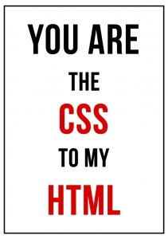
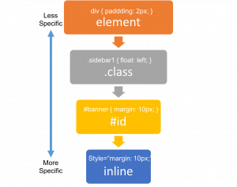

## Welcome to CSS!!

We are sure that after diving deep into HTML, everything looks kind of ugly, fixed, and rigid. We have to remember that HTML was created by CERN scientists, and they’re not – usually – the funniest kind of people (although they are the same exact scientists that 
[discovered The Higgs Boson](https://www.youtube.com/watch?v=0CugLD9HF94), and we do have to bow to our knees for that).  However, HTML is still ugly, and it’s ugly because it was created for a different purpose than the one HTML meets today.


But… The Internet is more beautiful than that. When the internet became popular, it stopped to be only a privilege for scientists and the army, and evolved to become **Part of our world!!**

Ironically, the same scientists at CERN who created HTML had to think about how to improve it. They were given the task to make it more beautiful. It was at this time that [Håkon Wium Lie](https://en.wikipedia.org/wiki/H%C3%A5kon_Wium_Lie) proposed the first version of CHSS in 1994, which was later adapted to become CSS1.

## So, What is CSS and why does it matter??




The main objective for his creation was to apply styles to HTML documents. The idea is to let you tell the browser how to display an HTML document: how to render its tags; in what color; margins; typography; icons; borders; etc. You can even redefine the original behaviors of the existing tags at your will. Eg:

```html
You could tell a <h1> to look just like a <h2> without the user 
realizing that, at first glance, they are different.
```

> :point_up:To understand the potential of CSS, [click here to see a live demo!](http://assets.breatheco.de/live-demos/css/bootstrap/)

Can you imagine the potential?  You can make almost everything look different!


## How do I apply styles to HTML?


Quite simple: You have to write your styles in a special syntax called "CSS" and save it on documents with the extension CSS.  Then, you apply the styles to the document using the `<link>` or the `<style>` tag.

Let’s review those 2 tags in more detail:

|**Name**   |**Display**   |**Description**   |
|:----------|:-------------|:------------------|
|Link       |link          |The purpose is to link the page with CSS stylesheets.  To use it, you must specify three attributes within the tag: `rel="stylesheet" type="text/css"` and finally `href="with document route css"`<br>like so: `<link rel="stylesheet" type="text/css" href="theme.css">`   |
|Style   |style   |If we do not want or can’t import a CSS style sheet, we have the alternative to define styles in the HEAD of the HTML document.  We simply define the style tag and proceed to write the styles we want for the tags.<br>`<style>`<br>`h1 { color:red; }`<br>`p { color:blue; }`<br>`</style>` |

> :point_up:Just like it happens with HTML docs (ending with .html) CSS docs (style sheets) end with extension `.css`.

## CSS Syntax


The CSS syntax is nothing similar to HTML syntax, it is its own specific programming language.  CSS does not use tags! To work with a website you have to shift your mindset several times because you will be working with several languages at the same time, and each one has its own syntax.


A CSS style sheet is a huge list of style definitions for each HTML element.  First you must specify which element – or group of elements – you are going to style; this is called SELECTOR.  Then you have to put a key `{` to indicate that you are going to start defining each attribute and its respective value, and you end that with another key `}`.  You should always finish each attribute definition with a semicolon `;`.

Watch the previous animation for a better understanding.

> :point_up:Spaces are ignored, but you need to use them to make your code easy to read.

The next example is a style sheet defining 3 different groups of styles (selector1, selector2, selector3); and each of these groups has different rules applied like: color, font size and background color.

You need to match HTML elements to groups of styles and use "selectors" to bind the HTML elements to the CSS groups of rules.

```css
#id-selector {
   color: red;
   font-size: 12px;
}
.class-selector {
   color: blue;
   background: green;
}
tag-selector 
{
   font-size: 15px;
}
```
## Wait… What is a "Selector"??


A selector is a way to refer or identify one or more HTML elements. For example, if you want to change the color of your web to red, you must do it as it follows:

```css
body {
    color: red;
}
```

You could also change the color of a single anchor `<a>`. To do that, you must define a `class` or an `id` attribute of the HTML tag defining that particular link `<a class="anchor1">`. Classes are preferred for use with CSS over IDs due to the fact that the former are reusable and the latter are more often used in conjunction with JavaScript. Once a tag has a class, then you can go to your style sheet and define the `color` rule as follows:

```css
.anchor1{
   color: red;
}
```
The next table shows a list of all possible types of selectors available to use in CSS. Please take your time to review it carefully. Your understanding here is key to continue with CSS, since you need to understand every possible style you can apply to an HTML doc:

### ID Selector

|**Selector**   |**Description**   |**Example**   |
|:--------------|:-----------------|:-------------|
|#element_id    |Allows the possibility to apply styles to a particular element   |`#element_id { color: red; }`   |

Let’s assign "first" as the ID of the first cell in the next table, and then with CSS we are going to specify that the ID "first" will have a yellow background:

<iframe width="100%" height="300" src="//jsfiddle.net/BreatheCode/1b78wna2/8/embedded/html,css,result/" allowfullscreen="allowfullscreen" allowpaymentrequest frameborder="0"></iframe>

<div align="right"><small><a href="//jsfiddle.net/BreatheCode/1b78wna2/8/embedded/html,css,result/">Click here to open demo in a new window</a></small></div>


### Class selector

|**Selector**   |**Description**   |**Example**   |
|:-------------|:-----------------|:-------------|
|.classname   |There is an attribute in HTML called "class", which allows us to group different tags within one logical group.  With CSS we can use `.` (dot) as a selector of every element using the class name to select all html elements with that class attribute.   |`.classname { color: #BDBDBD; }`   |

In the next example we are applying an "odd" class to the cells of this table, and then with CSS we are assigning the yellow background to class .odd:

### Tag selection

|**Selector**   |**Description**   |**Example**   |
|:--------------|:-----------------|:-------------|
|Element (tag) type   |This makes it possible to apply styles to links, titles, etc.  In the next example we shall change the text color of every link tag `<a>` on the page.   |`a { color: #BDBDBD; }`   |

Next, we are adding color (green) to the  background of each `td` (cells) of the table:

### Multiselector

|**Selector**   |**Description**   |**Examples**  |
|:--------------|:-----------------|:-------------|
|selector1,selector2   |If you separate multiple selectors with a comma`,`, you can assign multiple selectors at the same time to save text. In the following example, we tell every `h1, .odd{ color: #BDBDBD; }` class elements to turn red.   |`h1, .odd{ color: #BDBDBD; }`   |

### Advanced Selectors

With these 4 ways to select you are covering 99% of your needs; here what is important is to plan which will be on your Style sheet.

There are other specific and advanced selectors. You are probably going to use them when you start building something more challenging.

## Conflicts and correspondence


What happens if an element of the page is selected in two different selectors and has the green font color assigned to one definition and red in the other? In other words, if we have told the browser to find two different colors, what color will it end up getting?



You have to have a very good understanding of the CSS hierarchy in order to understand how the elements **correspond, overwrite and even null styles between them.**

The browser gives priority to more specific selectors like `#id` than the more general selectors like tags. In the following example, we changed the color of all the `<li>` (the items in the list) to blue, but then we changed the text of the second element to red. In this way we demonstrate that the ID selector will always prevail over selecting all the elements with the same tag.

## Properties


We have already seen that a CSS style sheet is nothing more than a list that defines the properties that we want to assign to different elements of the page. Now we have to learn what properties we can assign to these elements.

There are hundreds – even thousands – of CSS properties, but depending on the type of element/label that we want to define, we must focus on specific properties.

#### Typography editing
|Property   |Description   |Values   |
|:----------|:-------------|:----------|
|[font-family](http://www.mclibre.org/consultar/htmlcss/css/css-fuente.html#font-family)   |font type (font) | [ name-font \| generic-family ]*   |
|[font-size](http://www.mclibre.org/consultar/htmlcss/css/css-fuente.html#font-size)   |size of the font   |absolute-size \| relative-size \| distance \| percentage   |
|[font-style](http://www.mclibre.org/consultar/htmlcss/css/css-fuente.html#font-style)   |inclination (italics)   |normal \| italic \| oblique   |

#### Text editor

|Property   |Description   |Values   |
|:----------|:-------------|:-----------|
|[color](http://www.mclibre.org/consultar/htmlcss/css/css-texto.html#color)   |text color   |color   |
|[letter-spacing](http://www.mclibre.org/consultar/htmlcss/css/css-texto.html#letter-spacing)   |space between letters   |normal \| distance   |
|[line-height](http://www.mclibre.org/consultar/htmlcss/css/css-fuente.html#line-height)   |space between lines   |normal \| number \| distance \| percentage   |
|[text-align](http://www.mclibre.org/consultar/htmlcss/css/css-texto.html#text-align)   |text alignment   |center \| justify \| left \| right   |
|[text-decoration](http://www.mclibre.org/consultar/htmlcss/css/css-texto.html#text-decoration)   |text ornament   |none \| blink \| line-through \| overline \| underline   |
|[text-transform](http://www.mclibre.org/consultar/htmlcss/css/css-texto.html#text-transform)   |capital / small fonts   |none \| capitalize \| lowercase \| uppercase   |

#### List editing 

|Property   |Description   |Values   |
|:-----------|:-------------|:--------|
|[list-style](http://www.mclibre.org/consultar/htmlcss/css/css-listas.html#list-style)   |compound property (sum of every property combination)   |list-style-image\|\| list-style-position \|\| list-style-type   |
|[list-style-image](http://www.mclibre.org/consultar/htmlcss/css/css-listas.html#list-style-image)   |marker image   |none \| uri   |
|[list-style-position](http://www.mclibre.org/consultar/htmlcss/css/css-listas.html#list-style-position)   |marker position   |inside \| outside  |
|[list-style-type](http://www.mclibre.org/consultar/htmlcss/css/css-listas.html#list-style-type)  |marker type   |none \| circle \| disc \| square \| decimal \| decimal-leading-zero \| lower-alpha \| upper-alpha \| lower-greek \| lower-latin \| upper-latin \| lower-roman \| upper-roman \| armenian \| georgian \| hebrew(-) \| cjk-ideographic(-) \| hiragana (-) \| katakana (-) \| hiragana-iroha(-) \| katakana-iroha(-)  |

#### Table editing

|Property  |Description   |Values   |
|:----------|:-------------|:-----------|
|[border-collapse](http://www.mclibre.org/consultar/htmlcss/css/css-tablas.html#border-collapse)   |border mode   |collapse \| separate   |
|[border-spacing](http://www.mclibre.org/consultar/htmlcss/css/css-tablas.html#border-spacing)   |space between cells   |distance \| distance   |
[caption-side](http://www.mclibre.org/consultar/htmlcss/css/css-tablas.html#caption-side)   |legend position   |top \| bottom \| left(-) \| right(-)   |
|[empty-cells](http://www.mclibre.org/consultar/htmlcss/css/css-tablas.html#empty-cells)   |empty box border   |	hide \| show   |
|[table-layout](http://www.mclibre.org/consultar/htmlcss/css/css-tablas.html#table-layout)   |	algorithm width of the table   |auto \| fixed   |

#### Background editing 

|Property   |Description   |Values   |
|:----------|:-------------|:----------|
|[background-color](http://www.mclibre.org/consultar/htmlcss/css/css-fondos.html#background-color)   |background color   |transparent | color   |
|[background-image](http://www.mclibre.org/consultar/htmlcss/css/css-fondos.html#background-image)   |background image   |none \| uri   |
|[background-position](http://www.mclibre.org/consultar/htmlcss/css/css-fondos.html#background-position)   |background image position   |\[ \[ left \| center \| right \| distance \| percentage] [ top \| center \| bottom \| distancia \| porcentaje] \]? \| [ [ left \| center \| right ] \|\| [ top \| center \| bottom ] ]   |
|[background-repeat](http://www.mclibre.org/consultar/htmlcss/css/css-fondos.html#background-repeat)  |background repetition   |no-repeat \| repeat \| repeat-x \| repeat-y \| space(3) \| round(3)   |
|[background-size(3)](http://www.mclibre.org/consultar/htmlcss/css/css-fondos.html#background-size)   |background image size   |auto \| [ distance \| percentage ] {2} \| contain \| cover   |


 [Follow this link to see a detailed list of CSS properties from W3Schools.](https://www.w3schools.com/cssref/)


 


