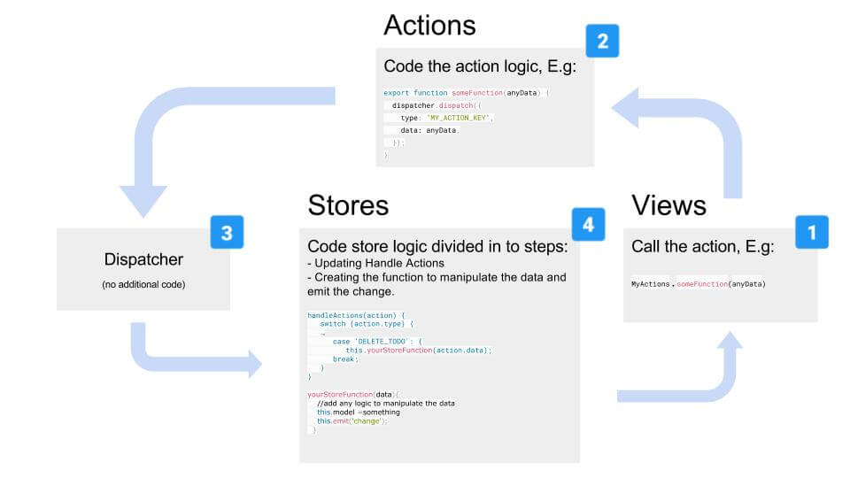

¿Recuerdas que siempre decimos que la programación es como Taco Bell?  ¡Siempre son los mismos ingredientes utilizados de una manera diferente!  En este caso particular, vamos a confiar mucho en los Eventos para crear toda la arquitectura de la aplicación.

## ¿Por qué necesitamos Flux?
***

Sabemos que todavía estás aprendiendo React.  Los states (estados) y las props (propiedades) pueden ser confusos, y ahora, con Flux, las cosas se van a poner un poco más difíciles ¡Pero es por una buena causa!

Sin Flux, no puedes crear aplicaciones React medianas o grandes porque todo se desorganizará bastante rápido.

Además, dos vistas diferentes no pueden enviar datos entre sí como lo hacen los componentes (utilizando props) porque todas las vistas son parientes y React Router las está instanciando. Necesitamos tener un store común compartido entre todas las vistas que vamos a llamar "The Store"

Aquí hay una lista de todas las ventajas de usarlo:

+ Centraliza y **separa los datos de la aplicación de los componentes:** la comunicación de la base de datos y el procesamiento de los datos ya no dependerán de cómo se vea la aplicación (renderización).
+ **Controla la forma en que fluirán los datos de tu aplicación:** no importa si los datos fueron ingresados por el usuario o provienen de una base de datos; todo estará disponible de forma clara y accesible.
+ Diferencia sus componentes en **vistas vs componentes reutilizables:** sus componentes seguirán siendo abstraídos desde la lógica de tu aplicación – haciéndolos 100% reutilizables para futuras aplicaciones.


### Flux divide la aplicación en 3 capas:

|&nbsp;     |&nbsp;       |
|:-----------|:----------------|
Vistas/Views (Componentes)     |Cada componente React que llama a cualquier acción Flux se llama una vista.  La razón para llamar a esos componentes de una manera diferente es porque se supone que los componentes de React se comunican entre sí a través de sus props (sin Flux).<br> <br>Una vez que un componente de React esté hard-coded en Flux, no podrás reutilizar ese componente en el futuro (en este o en cualquier otro desarrollo).       |
|Acciones (Actions)       |Las acciones ser gatilladas por componentes (cuando el usuario hace clic o interactúa con la aplicación) o por el sistema (por ejemplo, la funcionalidad de guardado automático).  Las acciones son el primer paso de cualquier flujo de trabajo de Flux y siempre deben enviarse al store.      |
|Stores       |El store contiene todos los datos de la aplicación.  Maneja todo lo que recibe el despachador y determina la forma en que se deben almacenar y recuperar los datos.            |

## Construyendo nuestra primera historia de usuario con Flux
***

El siguiente proyecto es una aplicación de To-Do List (lista de tareas) con 2 historias de usuario principales:

+ Crear tarea (ya desarrollada y en funcionamiento).
+ Eliminar tarea.

Para codificar la funcionalidad para eliminar, tenemos que actualizar 4 archivos principales: (1) El Componente (para cuando el usuario hace clic), (2) las Acciones (The Actions), (3) el Store (dos veces), y, (4) el Componente una última vez.  Son sólo 3 archivos y 5 actualizaciones.  Y tienes que hacer eso para cada historia de usuario que vayas a construir en tu aplicación.


> *Al final, trabajar con Flux tiene que convertirse en algo tan automático como andar en bicicleta.*




## Permite implementar la funcionalidad de eliminar tarea
***

#### 1) ¿Qué acción del usuario inicia la funcionalidad?

(Siempre es un evento típico de JS como: hacer clic, hover, cambiar el tamaño, etc.)

***Todo comienza cuando el usuario debe hacer click en el icono de la papelera. Es por eso que necesitamos iniciar nuestra aplicación escuchando el típico evento onClick en el botón de eliminar.***

```javascript
// En el componente que renderiza cada item todo, debemos agregar un botón y también un sensor onClick que llame 
// a la respectiva función TodoAction.deleteTodo(task) que crearemos en las acciones: 

<button onClick={()=>MyActions.deleteTodo(taskToDelete)}>delete</button>
```

#### 2) Luego necesitamos codificar nuestra acción dentro del archivo MyActions.js de esta forma:
```javascript{numberLines: true}
MyActions.js

// En este caso, decidimos que esta función (conocida como action) recibirá el ID de la tarea que se eliminará.
class MyActions extends Flux.Actions{
    deleteTask(taskToDelete){
         //obtiene la lista actual de acciondes del store
        let currentActions = MyStore.getActions();
        let updatedActions = currentActions.filter((task) => {
             return (task.id != taskToDelete.id);
        });

        this.dispatch('MyStore.setActions', updatedActions);
    }
}
```

#### 3) Actualizar el store para manejar la nueva acción enviada

```javascript{numberLines: true}
// Dentro de todoStore tenemos un método HandleActions que contiene la lógica para manejar cada acción distribuida. 
// Tenemos que agregar un nuevo caso al conmutador con el nombre 'DELETE_TODO'  
// Tiene que coincidir con el nombre de la acción que se envió. 
  
handleActions(action) {
  switch (action.type) {
    ...
    case 'DELETE_TODO': {
      this.deleteTodo(action.id);
      break;
    }
  }
}
```

#### 4) Dentro del To-Do Store, implementa la lógica real para eliminar la tarea y emitir los cambios

```javascript{numberLines: true}
// En cualquier lugar de tu TodoStore class, agrega un nuevo método que finalmente elimine la tarea del todo list. 
// En este caso estamos usando la función filter porque devuelve el mismo array pero sólo con
// los elementos que coinciden con la pregunta lógica dentro de filter (task.id! = id) 

class TodoStore extends EventEmitter {
  ...
  deleteTodo(id){
    this.todos = this.todos.filter((task)=>{
       //filtra todas las tareas que tienen el id dado
      return (task.id != id);
    });
    this.emit('change');
  }
  ...
}
```

## El Resultado
***

Finalmente, tenemos una nueva funcionalidad implementada en nuestro proyecto.  Para seguir agregando más funcionalidades, solo tiene que iniciar de nuevo el worflow de codificación de Flux desde el paso 1.

<iframe src="https://codesandbox.io/embed/j1nvpono23" style="width:100%; height:500px; border:0; border-radius: 4px; overflow:hidden;" sandbox="allow-modals allow-forms allow-popups allow-scripts allow-same-origin"></iframe>

<div align="right"><small><a href="https://codesandbox.io/embed/j1nvpono23">Haz clic aquí para abrir el demo en una nueva ventana</a></small></div>


